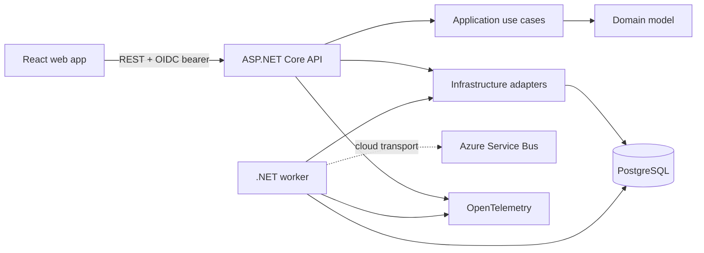

# MatterHarbor

MatterHarbor is an early-stage, open-source case and incident management system for municipalities, housing companies, and internal enterprise teams. It demonstrates a modular .NET monolith, a separate outbox worker, React, PostgreSQL, Azure-oriented infrastructure, testing, security controls, and OpenTelemetry.

MatterHarbor is not production-ready. Do not use it with real personal data.

## Current status

The repository currently implements one small vertical slice:

- development-only persona authentication and generic production OIDC bearer configuration;
- organization-scoped case list, case details, case creation, and status updates;
- required idempotency keys, replay, and conflicting-payload detection;
- integer optimistic concurrency;
- same-transaction case, immutable audit, idempotency, and outbox persistence;
- a leased outbox worker with local structured notification logging and an Azure Service Bus adapter;
- PostgreSQL migrations and development seed personas;
- liveness/readiness endpoints, rate limiting, problem details, security headers, and OpenTelemetry;
- React persona selection, case list, creation form, and details screen;
- unit, architecture, hosted HTTP/PostgreSQL integration, frontend interaction, and live Playwright tests;
- local Compose dependencies, container definitions, CI, and un-deployed Bicep infrastructure.

Azure deployment, file uploads and malware scanning, GDPR workflows, search, assignment workflows, dashboards, backups, and operational hardening are planned, not implemented.

## Architecture



The API is a modular monolith. The worker is a separate process because it has a different lifecycle and scaling profile; it shares the Infrastructure and Domain code instead of inventing microservices. See [architecture overview](docs/architecture/overview.md) and [ADRs](docs/decisions/).

## Toolchain

- .NET SDK 10.0.300 (pinned by `global.json`), .NET 10 projects
- Node.js 22.13.0 or later in the Node 22 line
- PostgreSQL 17
- Docker 29+ with Docker Compose
- npm dependencies pinned by `package-lock.json`

## Run locally

Prerequisites: .NET 10 SDK, Node 22, npm, Docker, and Docker Compose.

```bash
docker compose up -d
dotnet restore MatterHarbor.sln
dotnet tool restore
dotnet build MatterHarbor.sln
dotnet run --project src/MatterHarbor.Api
```

In two more terminals:

```bash
dotnet run --project src/MatterHarbor.Worker
npm --prefix src/MatterHarbor.Web install
npm --prefix src/MatterHarbor.Web run dev
```

Open <http://localhost:5173>. The API uses the launch profile at <http://localhost:5080>; Jaeger is at <http://localhost:16686>. The API applies migrations and inserts fictional personas only in `Development`.

Run all normal checks (the live browser project runs separately because it owns a disposable stack):

```bash
dotnet restore MatterHarbor.sln --locked-mode
dotnet tool restore
dotnet build MatterHarbor.sln --no-restore
dotnet test MatterHarbor.sln --no-build --filter "Category!=EndToEnd"
dotnet format MatterHarbor.sln --verify-no-changes --no-restore
npm --prefix src/MatterHarbor.Web ci
npm --prefix src/MatterHarbor.Web run lint
npm --prefix src/MatterHarbor.Web run test
npm --prefix src/MatterHarbor.Web run build
```

On PowerShell 7, `./scripts/test.ps1` performs the same workflow and handles Windows' `npm.cmd` launcher. Run `./scripts/test-e2e.ps1` for the unskipped API + worker + web + PostgreSQL browser flow. Release verification also includes:

```bash
dotnet list MatterHarbor.sln package --vulnerable --include-transitive
npm --prefix src/MatterHarbor.Web audit --audit-level=high
docker compose config --quiet
docker compose --file compose.e2e.yaml config --quiet
docker build --file src/MatterHarbor.Api/Dockerfile --tag matterharbor-api:verify .
docker build --file src/MatterHarbor.Worker/Dockerfile --tag matterharbor-worker:verify .
docker build --file src/MatterHarbor.Web/Dockerfile --tag matterharbor-web:verify .
az bicep build --file infra/bicep/main.bicep
```

See [local development](docs/development/local-development.md) and [reproducible build instructions](docs/development/reproducible-builds.md).

## API

In Development, send `X-MatterHarbor-User: alex` or `X-MatterHarbor-User: casey`. Case creation also requires `Idempotency-Key`.

- `GET /api/cases?page=1&pageSize=25`
- `GET /api/cases/{id}`
- `POST /api/cases`
- `PUT /api/cases/{id}/status`
- `GET /health/live`
- `GET /health/ready`
- `GET /openapi/v1.json` (Development only)

Production configuration uses HTTPS OIDC metadata and validates issuer, audience, lifetime, and organization/user claims. Development authentication throws during startup outside the Development environment.

## Contributing and security

Read [CONTRIBUTING.md](CONTRIBUTING.md), [AGENTS.md](AGENTS.md), and [SECURITY.md](SECURITY.md). Never include real case data, credentials, or access tokens in issues, fixtures, logs, or commits.

## Supported v0.1 scope

v0.1 supports only the fictional-data learning slice listed under Current status, run locally or in CI. It does not support production deployment, real personal data, file handling, privacy lifecycle workflows, role administration, backup/restore operations, or an operational service-level commitment. See the [v0.1 release notes](docs/releases/v0.1.0.md) for the exact boundary.

## License

MIT. See [LICENSE](LICENSE).
