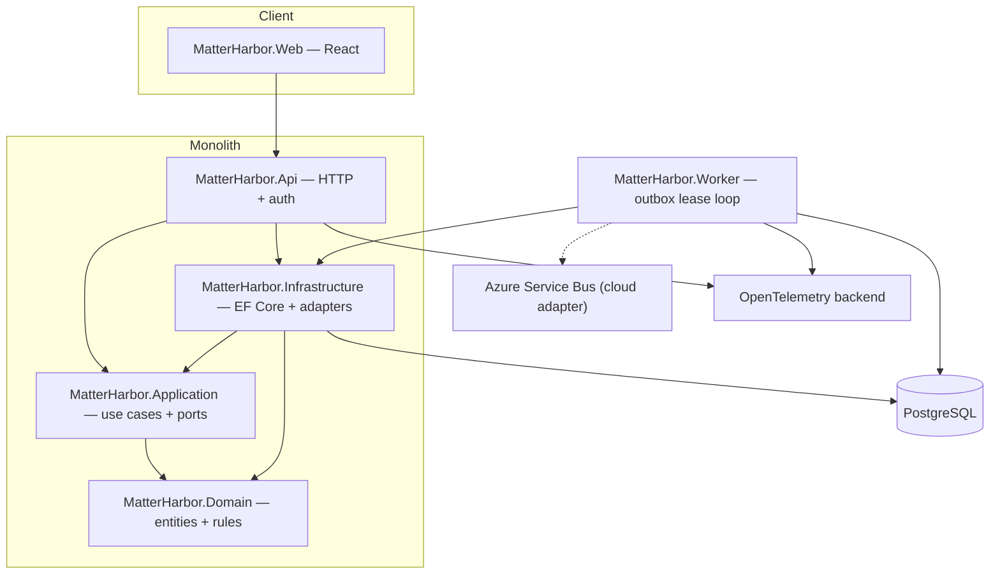

# Architecture overview

MatterHarbor uses a modular monolith plus one separate background worker. This keeps transactions and local development simple while giving asynchronous work an independent lifecycle.

## Case creation flow

1. Authentication produces trusted user and organization claims.
2. The API ignores any browser organization identifier and creates `UserContext` from those claims.
3. The application opens a transaction and acquires a PostgreSQL transaction-scoped advisory lock for organization + idempotency key.
4. A matching stored request replays its original response; a different hash returns 409.
5. The domain creates the case and the application adds audit, outbox, and idempotency records.
6. EF Core writes all records and commits once.
7. The worker conditionally claims pending/expired records with a lease, publishes through the configured adapter, and marks success. Crashed leases become claimable again.

This design provides at-least-once processing. Consumers must remain idempotent; local logging does not prove Azure Service Bus semantics.

## Verification architecture

Hosted integration tests execute the real HTTP middleware and endpoints against disposable PostgreSQL. The Playwright job starts disposable web, API, worker, and PostgreSQL containers, creates a fictional case through the browser, and confirms in PostgreSQL that the worker processed its outbox message.

## Trade-offs

The application uses an explicit `ICaseStore` port instead of a generic repository. PostgreSQL advisory locks serialize same-key retries without a distributed cache. Read models currently use domain entities because the slice is small; dedicated projections can be introduced when queries diverge. Database migration and fictional seeding run automatically only at Development API startup. CI builds and applies a checksummed migration bundle; integrating that artifact with restricted identities, approval gates, and backup/restore remains deployment work.
